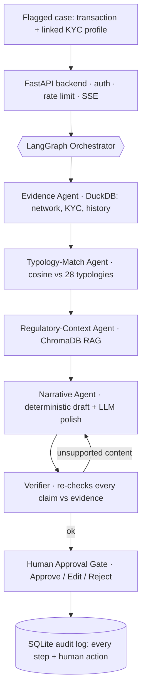

<div align="center">

# 🛡️ ComplianceAgent

**A multi-agent AML/KYC case-investigation copilot** that pre-screens flagged transactions,
drafts case narratives and Enhanced Due Diligence (EDD) reports with **full evidence citations**,
**verifies every claim against source data**, and routes every case through a **mandatory human
approval gate** — it never auto-clears or auto-reports.

`LangGraph` · `FastAPI` · `React + TypeScript` · `DuckDB` · `hybrid RAG (BM25+dense+rerank)` · `GNN detector (from-scratch NumPy)` · `NetworkX graph analytics` · `Gemini / Groq / offline` · `eval gates` · `Langfuse observability` · `OWASP guardrails` · **$0/month**

### 🔗 Live demo
- **App (Vercel):** https://frontend-three-pi-15.vercel.app
- **API (Render):** https://complianceagent-backend.onrender.com/api/health
- _The API runs on Render's free tier and **sleeps after ~15 min idle**, so the first request after inactivity has a ~30–60s cold start — just give the first case a moment to load._

</div>

> ⚠️ **Disclaimer.** This is a **portfolio / demo** system built on **synthetic data**. It is **not**
> certified compliance software, it does **not** file reports, and **every output is a draft that
> requires human sign-off**. Nothing in this system auto-clears or auto-reports a case.

---

## Why this project

AML alert triage is a real bottleneck in banks: analysts drown in flagged transactions and spend
hours assembling evidence and writing case narratives / EDD reports by hand. This project is **not
another fraud-detection classifier** — it is the **investigation and documentation layer above one**:

- **Orchestrated specialist agents** that assemble evidence, match typologies, pull regulatory
  context, and draft the case.
- **A Verifier** that checks *every* factual claim, figure, and citation against the actual queried
  evidence — not the LLM's own say-so.
- **A mandatory, backend-enforced human approval gate** before any case is finalized.
- **A full, persistent audit log** of every agent decision and every human action.

It is designed to demonstrate **production-grade agentic AI engineering in a regulated domain**
(explainability, auditability, human-in-the-loop governance) for AI/Compliance/Agentic-AI roles in
the UAE banking & fintech market.

---

## Architecture




Every agent step is **logged to the audit trail** and **emitted as a live SSE event** so the frontend
renders the reasoning as it happens.

---

## The agents

| Agent | Role | How it works |
|---|---|---|
| **Evidence** | Assemble the case | Queries DuckDB for the case's transaction network, subject + counterparty KYC, and prior history; computes a deterministic behavioural fact/signal vector + a NetworkX graph. **No LLM** — evidence must be hard ground truth. |
| **Screening** | Sanctions / PEP | Screens the subject + counterparties (fuzzy name match, Jaro-Winkler) and every jurisdiction against **sanctions / PEP / high-risk watchlists**. A sanctions match is a **hard escalation** that forces Critical, independent of any laundering typology. Public OFAC/UN list refresh included. |
| **GNN Detector** | Graph-based risk | A **2-layer Graph Convolutional Network built from scratch in NumPy** (trained on the account graph, class-imbalance-aware) scores every account for laundering involvement → per-node risk, case risk, and the highest-risk subgraph (GNNExplainer-lite). Ensembled with the typology confidence + screening risk. |
| **Typology-Match** | Classify the pattern | Cosine similarity between the case signature and each of the **28 SAML-D typologies**, returning a ranked best match, confidence, and the dimensions that drove it. Deterministic and explainable — the LLM never "guesses" the label. |
| **Regulatory-Context** | Ground it in policy | **Advanced RAG** over a ~112-chunk regulatory KB: **hybrid retrieval** (BM25 + dense embeddings, **RRF-fused**) → **reranking** (funnel), reporting **Recall@5 / MRR / nDCG@10**. Embeddings are pluggable — offline hashing ($0) or **Gemini neural** (`EMBEDDING_BACKEND=gemini`); reranker is lexical (default) or **LLM** (`RERANKER=llm`). |
| **Narrative** | Draft the case | Builds a deterministic, evidence-cited EDD draft + machine-checkable claims, then asks the LLM to *polish the prose only*. The offline provider (and any failure) returns the deterministic draft verbatim. |
| **Verifier** | Guard correctness | Recomputes every structured claim, checks every `TXN…` citation exists, and checks every currency figure matches a real evidence amount. Flags unsupported content and **triggers a deterministic retry**. |
| **Orchestrator** | Coordinate | A **LangGraph** state machine with conditional edges and the retry path. |

---

## Free-tier LLM strategy (why not Claude)

The Anthropic API has no standing free tier, so the LLM sits behind a **single provider-agnostic
interface** (`app/llm/llm_client.py`) selected by one env var:

- **`gemini`** — Google AI Studio (Gemini 2.5 Flash), the intended **primary** (free tier, no card).
- **`groq`** — Llama 3.3 70B, the **failover** lane (free tier, no card).
- **`offline`** — a **deterministic, no-network** provider so the *entire system runs end-to-end at
  $0 with no API keys at all* (used by default and in CI).

Every LLM call supplies a deterministic, evidence-grounded `fallback_text`. If the provider is
`offline`, or if every online provider fails (rate limit / auth / network), the client returns that
draft — so the copilot **always** produces sensible, evidence-grounded output. Swapping providers is
a one-line config change; no agent code imports a provider SDK directly.

---

## Dataset

- **Primary reference:** **SAML-D** (Synthetic Anti-Money-Laundering Transaction Data) — ~9.5M
  synthetic transactions across **28 typologies** (11 normal + 17 suspicious, including graph
  structures: fan-in, fan-out, cycles, scatter-gather, gather-scatter). SAML-D is *fully synthetic*,
  released precisely because real AML data can never be lawfully published.
- **Supplementary:** synthetic **KYC** profiles (risk rating, PEP, jurisdiction, occupation, expected
  volume, source of funds) joined at the account level.

**What this repo generates.** The full 9.5M rows are far too large for an interactive MVP, and Kaggle
downloads require auth. So `app/data_pipeline.py` deterministically generates a **schema-faithful
sample** (~2.8k transactions, 280 customers, **34 investigation cases**) that embeds the **same graph
typology structures across all 28 typologies**, joined with KYC. This is a deliberate, industry-standard
choice — see [`backend/data/data_dictionary.md`](backend/data/data_dictionary.md) for the schema,
subsetting method, the 28 typology definitions, and explicit limitations. If you drop the real Kaggle
SAML-D CSV into `backend/data/raw/`, the pipeline detects it (see `_load_real_saml_d`) for ingestion.

---

## Run locally

**Prerequisites:** Python 3.9+ and Node 18+.

### 1. Backend (FastAPI)
```bash
cd backend
python3 -m venv .venv && source .venv/bin/activate
pip install -r requirements.txt
cp .env.example .env                 # defaults run at $0 with the offline provider
python -m app.data_pipeline          # builds DuckDB + ChromaDB + reference docs
uvicorn app.main:app --reload --port 8099
```
Health check: <http://127.0.0.1:8099/api/health> · API docs: <http://127.0.0.1:8099/docs>

To use a real LLM, set `LLM_PROVIDER=gemini` and `GEMINI_API_KEY=…` (or `groq` / `GROQ_API_KEY`) in
`backend/.env`.

### 2. Frontend (React + Vite)
```bash
cd frontend
npm install
cp .env.example .env                 # VITE_API_URL=http://127.0.0.1:8099, VITE_API_KEY=dev-local-key
npm run dev
```
Open the printed URL (e.g. <http://localhost:5173>). Select a case → **Run investigation** → watch the
agents stream → review the draft → **Approve / Edit / Reject** at the human gate.

### 3. Docker (backend)
```bash
docker compose up --build            # backend on http://localhost:8099 (dataset built into the image)
```

### Run the tests
```bash
cd backend && pytest -q              # 25 tests, fully offline
```

---

## Evaluation (eval-driven development)

Evaluation is a **first-class, CI-gated pipeline** — not an afterthought.
[`backend/eval/run_eval.py`](backend/eval/run_eval.py) runs the full multi-agent pipeline over the
labelled case set and computes RAGAS/DeepEval-style metrics **against the queried evidence** (so they
need no LLM judge and cost $0), then **fails the build if any gate is violated**. Full generated report:
[`evaluation/eval_results.md`](evaluation/eval_results.md).

**Results (deterministic, reproducible — `LLM_PROVIDER=offline`):**

| Metric | All 34 cases | Benchmark (16) | |
|---|---|---|---|
| Typology routing — top-1 | 0.68 | **1.00** | |
| Typology routing — **top-3** | **1.00** | **1.00** | ✅ gate |
| Context precision@1 (RAG) | 1.00 | 1.00 | |
| Context recall (RAG) | 1.00 | 1.00 | ✅ gate |
| Ground-truth recall@3 (RAG) | 0.74 | 1.00 | |
| **Retrieval Recall@5** (hybrid KB) | 0.68 | — | ✅ gate |
| **Retrieval MRR** | **1.00** | — | |
| **Retrieval nDCG@10** | **0.84** | — | ✅ gate |
| **Faithfulness** (claims grounded) | **1.00** | 1.00 | ✅ gate |
| Citation validity | 1.00 | 1.00 | ✅ gate |
| **Hallucination rate** | **0.00** | 0.00 | ✅ gate |
| Answer relevancy (proxy) | 1.00 | 1.00 | |
| **Verifier catch rate** (adversarial) | **1.00** | 1.00 | ✅ gate |
| Avg latency / p95 | 67 ms / 99 ms | — | |
| Avg cost / case | $0.00 (offline) | — | |

- **6 CI gates** (top-3, context-recall, faithfulness, citation-validity, hallucination, verifier-catch)
  run on every push via [`.github/workflows/ci.yml`](.github/workflows/ci.yml) and in
  [`backend/tests/test_eval.py`](backend/tests/test_eval.py).
- **Optional LLM-as-judge suite** ([`backend/eval/deepeval_suite.py`](backend/eval/deepeval_suite.py))
  runs the framework-backed **DeepEval** metrics (Faithfulness / Answer-Relevancy / Hallucination) using
  the project's own `LLMClient` as the judge, when a Gemini key is set.
- The remaining top-1 misses are all between **genuinely sibling typologies** (scatter-gather vs
  gather-scatter, structuring vs cash-intensive structuring) — the correct label is *always* in the top-3.

---

## Observability & cost model

Every investigation is instrumented for **step-level latency, token usage, and $ cost** — surfaced in
the UI (a metrics strip on the narrative), in the API result (`result.metrics`), and in the audit log.

- **Local metrics — always on, $0.** Per-agent span timings + per-LLM-call token/cost, with a per-model
  price table ([`backend/app/tools/tracing.py`](backend/app/tools/tracing.py)).
- **Langfuse tracing — optional.** Set `LANGFUSE_PUBLIC_KEY`/`LANGFUSE_SECRET_KEY` and every agent node
  + LLM call streams to a hosted [Langfuse](https://langfuse.com) trace. Tracing is a safe no-op when
  unconfigured and never raises.
- **Model router.** `generate(task=…)` routes lightweight tasks to a cheaper model tier
  (`gemini-2.5-flash-lite` / `llama-3.1-8b`) and the narrative to the primary model — the standard
  cost-optimisation lever.
- **Cost model.** Offline provider = **$0/case**. With live Gemini 2.5 Flash a full investigation is a
  single ~1–2k-token narrative call ≈ **$0.001–0.003/case** (illustrative list prices; see the price
  table). Retrieval, typology-matching, and verification use **no** LLM tokens by design.
- **Prometheus `/metrics`** ([`app/tools/metrics.py`](backend/app/tools/metrics.py)) — real Prometheus
  exposition (HTTP, investigations, `gen_ai.*` tokens/cost, cache, jobs, risk-band distribution) with a
  **Grafana dashboard** ([`docs/grafana_dashboard.json`](docs/grafana_dashboard.json)) importable into
  Grafana Cloud's free tier.
- **Async jobs** ([`app/tools/jobs.py`](backend/app/tools/jobs.py)) — non-blocking investigations
  (`POST /api/cases/{id}/investigate/async` → poll `GET /api/jobs/{id}`); in-process for the free tier,
  same interface swaps to Celery/RQ + Redis for scale.
- **Caching** ([`app/tools/cache.py`](backend/app/tools/cache.py)) — in-process TTL cache by default,
  **Redis** when `REDIS_URL` is set (free Upstash); cache hit-rate exported to Prometheus.

See [`DECISIONS.md`](DECISIONS.md) for the architecture decision records behind these choices.

---

## GNN detector (graph-based AML — the SOTA)

GNNs are the state of the art for AML network detection. Rather than pull in
PyTorch (which would blow the 512 MB free tier), this project ships a **2-layer
Graph Convolutional Network implemented from scratch in NumPy**
([`backend/gnn/`](backend/gnn/)) — genuine forward + backprop + Adam, trained on the
account-level transaction graph:

- **Task:** node classification — is an account involved in laundering, given its
  behavioural features + graph neighbourhood.
- **Class imbalance** handled with a class-weighted loss (`pos_weight = neg/pos`).
- **Results (held-out accounts):** F1 **0.70**, PR-AUC **0.83**, ROC-AUC **0.82**.
- **Serving:** a new **GNN Detector agent** scores each case's subgraph → per-node
  illicit probability, a case-level GNN risk score, and the top-risk accounts;
  inference is pure NumPy, so it adds negligible weight to the deployed service.
- **Ensemble:** the GNN case risk is combined with the deterministic typology
  confidence into an **overall risk score + band** (Low → Critical).
- **UI:** the transaction-network graph **colours nodes by GNN illicit risk**, and a
  GNN panel shows the ensemble meter, model metrics, and the highest-risk subgraph.
- **Upgrade path:** a PyTorch-Geometric training script (GraphSAGE / temporal
  LAS-GNN) — see `requirements-gnn.txt`.

## Analyst chat — planner + tool-use + case memory

A conversational agent ([`app/agents/chat_agent.py`](backend/app/agents/chat_agent.py)) answers
multi-turn questions about a case. A lightweight **planner/supervisor** classifies the question into
intents and **dynamically routes** to the right tools (evidence, screening, typology, risk, SAR) plus
**case memory** — an embedding-recall index ([`app/tools/memory.py`](backend/app/tools/memory.py)) that
surfaces the most similar prior cases and their dispositions ("resembles CASE-0030, sanctioned, sim
0.94"). Answers are grounded ONLY in the case, prompt-injection is blocked, and it works offline ($0),
richer with Gemini. Exposed in the UI's **Analyst Chat** tab.

## Regulatory filing — SAR/STR + goAML export

A completed investigation generates a **draft STR** ([`app/tools/sar.py`](backend/app/tools/sar.py)):
coded suspicious-activity category (FinCEN SAR Item-35-style, mapped per typology) + subject +
indicators + narrative, plus a **filing SLA** (deadline + status from the human determination date).
It exports as **goAML XML** — the UNODC/UAE-FIU STR filing format — downloadable from the UI
(`GET /api/cases/{id}/sar.xml`). Draft for the MLRO's filing decision; the tool prepares the STR, it
does not file it.

## Advanced capabilities (graph analytics · real-data ingestion)

- **Graph analytics ([`app/tools/graph.py`](backend/app/tools/graph.py)).** Each case's transactions are
  modelled as a **NetworkX** directed multigraph; the pipeline computes real network features
  (degree, betweenness centrality, cycles, communities, connected components, reciprocity) and the UI
  renders an animated **transaction-network graph** (subject highlighted, flagged edges in red) — the
  foundation graph-based AML detection builds on.
- **Real-dataset ingestion ([`app/data_ingest.py`](backend/app/data_ingest.py)).** Ingests the **IBM
  AMLworld / AMLSim** CSV schema (the standard open AML benchmark) — derives investigation cases from
  connected laundering components and runs them through the same pipeline. Ships a schema-faithful
  sample; drop a real Kaggle `*_Trans.csv` into `backend/data/raw/` and set `INCLUDE_AMLWORLD=1`. This
  directly answers the "but it's synthetic" critique.

## Guardrails — mapped to the OWASP Top 10 for LLMs

Lightweight, dependency-free defenses in [`app/tools/guardrails.py`](backend/app/tools/guardrails.py)
(Presidio / LLM-Guard are documented upgrade paths):

| OWASP | Control |
|---|---|
| **LLM01 Prompt Injection** | Free-text fields (alert summaries, analyst notes, edited narratives) screened for override/jailbreak patterns; injected review inputs are **rejected (422)**. |
| **LLM02 Insecure Output Handling** | Model output scanned for PII/injection echoes before it's surfaced. |
| **LLM05 Improper Input Handling** | Case ids, reviewer names, and decision enums validated. |
| **LLM06 Sensitive Info Disclosure** | PII (email/SSN/IBAN/Luhn-valid cards) detected and **redacted**. |
| **LLM09 Over-reliance** | Every claim verified against source evidence (the Verifier). |

Plus the core guardrails (all genuinely functional, not cosmetic):

- **Verifier checks against real data.** It re-queries the evidence and recomputes/matches every claim,
  figure, and citation — see `test_verifier_flags_unsupported_claim`.
- **Human approval gate is backend-enforced.** A case only reaches a finalized state via a persisted
  human decision (`POST /api/cases/{id}/review`). No code path auto-approves.
- **Persistent audit log.** Every agent decision and human action is written to SQLite with timestamps
  (`app/tools/audit.py`), viewable in the UI.
- **Versioned prompts.** Prompt templates carry a version (`narrative-v1`), surfaced in results/audit.
- **Draft-only framing everywhere.** The UI banner, generated narratives, and API all state the output
  is a draft pending human review; the system never implies a case is cleared or reported.

---

## Auth & RBAC (operational store)

Real multi-user access control ([`app/auth.py`](backend/app/auth.py), [`app/models.py`](backend/app/models.py)):

- **JWT login** (`POST /api/auth/login`) with PBKDF2-hashed passwords; roles
  **analyst < mlro < admin**. The demo `X-API-Key` still works (maps to a demo admin).
- **RBAC enforced per route:** an analyst may **edit** a draft, but only an **MLRO/admin**
  may approve / reject / escalate (the review endpoint returns **403** otherwise);
  only **admin** manages users. The recorded reviewer is the *authenticated* user.
- **Polyglot persistence:** DuckDB stays the analytical engine for transactions;
  a **SQLAlchemy** operational store (users, case assignments) is **Postgres-ready**
  (`DATABASE_URL` → free Neon/Supabase) with a **SQLite** fallback so it still runs at $0.
- **Demo accounts:** `analyst/analyst123`, `mlro/mlro123`, `admin/admin123` (or "Continue as demo").

## Production hardening

- JWT + RBAC (above); API-key lane retained for the demo.
- Per-client sliding-window **rate limiting** on the case-processing endpoints.
- **Graceful LLM failover** (Gemini → Groq → deterministic offline) with clean, non-stack-trace error
  messages surfaced to the frontend.
- CI (GitHub Actions): ruff lint + pytest **+ the evaluation gate** on the backend, ESLint + type-check
  + build on the frontend.
- **Step-level observability** (latency/tokens/cost per agent) always on; optional Langfuse tracing.
- No secrets committed; everything sensitive is via `.env` (`.env.example` documents every variable).

---

## Deployment

- **Backend → Render** (free web service). The `Dockerfile` builds the dataset into the image and serves
  on `$PORT`. Note: the free tier **sleeps on inactivity**, so the first request after idle has a
  cold-start delay (typically 30–60s) — expected for a portfolio demo.
- **Frontend → Vercel** (Hobby). Set `VITE_API_URL` to the live backend URL and `VITE_API_KEY` to match
  the backend's `BACKEND_API_KEY`.
- **Live demo:** https://frontend-three-pi-15.vercel.app (API: https://complianceagent-backend.onrender.com)
  · **Walkthrough:** see [`docs/demo_video_link.md`](docs/demo_video_link.md).

---

## Repo layout

```
backend/    FastAPI · LangGraph agents · DuckDB · vector RAG · SQLite audit
backend/gnn/   from-scratch NumPy GCN — features, model, training, weights
backend/eval/  eval pipeline (metrics + CI gates) + optional DeepEval LLM-judge
frontend/   React + TS + Vite + Tailwind · SSE hook · premium light/dark UI
docs/       architecture diagram · demo walkthrough
evaluation/ benchmark case set + generated eval_results.md
DECISIONS.md  architecture decision records
```

---

## Where this breaks (known failure modes — be honest)

- **Synthetic data.** Typologies are simplified, stylised representations; thresholds and jurisdiction
  lists are illustrative, not a regulatory reference. *Fix path: ingest IBM AMLworld / Elliptic.*
- **Deterministic typology matcher** favours transparency over raw accuracy; sibling typologies are
  sometimes swapped at top-1 (always caught in top-3). An **independent GNN risk score is now
  ensembled in** to corroborate it; the GCN is transductive-trained (applied to case subgraphs), so
  its per-case scores are indicative rather than calibrated probabilities.
- **Hashing-embedding RAG** has no true semantic generalisation and won't scale to a large corpus.
  *Fix path: neural embeddings + hybrid (BM25+dense) + a cross-encoder reranker — the retrieval
  interface is isolated for exactly this swap.*
- **Offline LLM prose** is templated (excellent for auditability and $0 running, less "fluent" than a
  live model). *Fix path: set `GEMINI_API_KEY` — the client already routes to it.*
- **Free-tier cold start.** Render sleeps after ~15 min idle → the first request can take 30–60s.
- **Single-tenant, lightweight auth** (shared API key) — not an enterprise IAM; no role separation
  (analyst vs MLRO) yet.
- **Eval covers structure, not subjective quality.** The deterministic gates prove groundedness and
  guardrails; judging prose quality needs the optional LLM-as-judge suite.

---

## Future improvements

- Real vector-DB-backed, multi-jurisdiction regulatory knowledge base (with citations to actual
  regulations).
- Graph-native typology detection (GNN) feeding the matcher.
- Arabic-language case narratives for the UAE market.
- Analyst feedback loop that fine-tunes typology thresholds.
- SSO + role-based access (analyst / MLRO) and true SAR/STR workflow integration.

---

## Viva / interview Q&A

<details>
<summary><b>Why multiple agents instead of one big prompt?</b></summary>

Separation of concerns makes each step **auditable and independently testable**. Evidence gathering,
typology matching, and verification are deterministic and don't need an LLM at all; only the narrative
prose does. A single mega-prompt would blur these boundaries, be far harder to verify, and couple
correctness to model behaviour — unacceptable in a regulated workflow.
</details>

<details>
<summary><b>How does the Verifier actually work — isn't it just the LLM checking itself?</b></summary>

No. The Verifier re-queries the **actual evidence** and (1) recomputes every structured claim from the
facts, (2) confirms every `TXN…` citation exists in the case's real transaction set, and (3) confirms
every currency figure matches a real evidence amount within tolerance. It has data access; it does not
ask the LLM to "double-check." If it finds an invented figure or citation, it fails and the orchestrator
re-drafts deterministically. See `test_verifier_flags_unsupported_claim`.
</details>

<details>
<summary><b>Why a human-in-the-loop gate — why not full autonomy?</b></summary>

In AML/KYC, clearing or reporting a case has legal consequences (SAR/STR filings, customer impact,
regulatory liability). Full autonomy is both a compliance and an ethical non-starter. The copilot's job
is to **compress the analyst's work**, not replace their judgement. The gate is backend-enforced: no
case is finalized without a persisted human decision, and everything is captured in the audit log.
</details>

<details>
<summary><b>Why is the typology matcher deterministic rather than an LLM classifier?</b></summary>

Reproducibility and explainability. The same case always yields the same ranked match with the same
driving dimensions — which a regulator or an auditor can inspect. An LLM classifier would be a black box
with run-to-run variance. The LLM is reserved for the one thing it's best at: readable prose.
</details>

<details>
<summary><b>How would you scale this to the real 9.5M-row SAML-D?</b></summary>

DuckDB already handles far more than the sample; the agents query per-case, so scale is bounded by the
case network, not the table. For production I'd add proper alert generation upstream, partition the data,
move the audit log to Postgres, add a real vector DB, and put the LLM behind a queue with per-tenant
rate limits and the same failover chain.
</details>

<details>
<summary><b>How do you keep it $0?</b></summary>

DuckDB, ChromaDB (with local hashing embeddings — no model downloads), and SQLite are all embedded and
free. The LLM defaults to a deterministic offline provider, with Gemini/Groq free tiers available via a
one-line config change. Hosting uses Render + Vercel free tiers.
</details>

---

<div align="center">
<sub>Built as a portfolio project. Synthetic data · draft-only outputs · human sign-off required.</sub>
</div>
