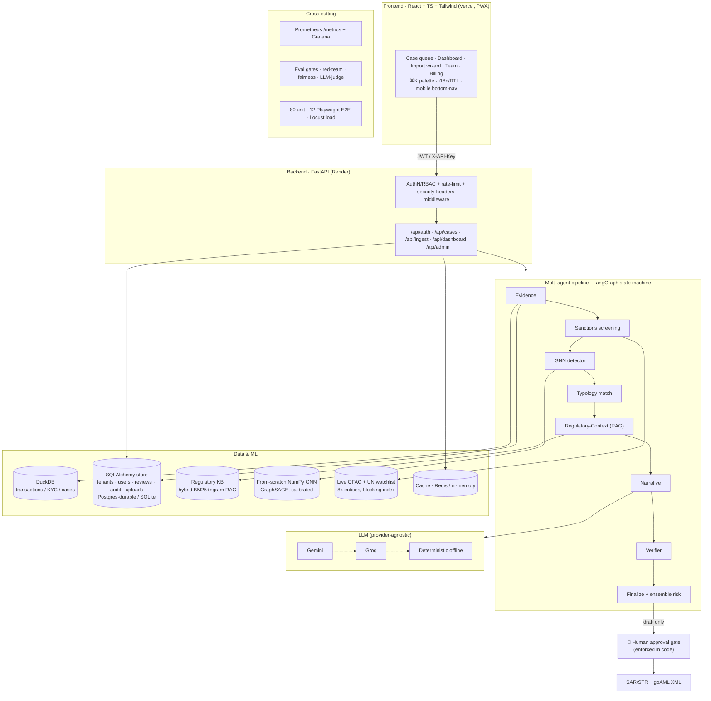

# ComplianceAgent — Architecture

A multi-tenant, multi-agent AML/KYC investigation platform. Everything runs at **$0**
on free tiers; every design choice is swap-in-ready for production scale.

## System overview

## The 8-step agent pipeline
Deterministic `LangGraph` state machine (not a free-form loop), with a bounded retry
edge from Verifier → Narrative:

1. **Evidence** — pulls the case's transactions, KYC, network graph (no LLM; hard ground truth).
2. **Sanctions screening** — fuzzy match (Jaro-Winkler + blocking) vs the **real OFAC/UN** lists; a hit forces escalation.
3. **GNN detector** — from-scratch NumPy GraphSAGE scores each account; calibrated (Platt, Brier/ECE).
4. **Typology match** — 28 laundering patterns, rule-based + explainable.
5. **Regulatory-Context (RAG)** — hybrid BM25 + n-gram-dense retrieval, RRF-fused, reranked.
6. **Narrative** — LLM drafts the report, citing exact transactions/amounts.
7. **Verifier** — re-checks every figure and citation against the evidence; rejects + retries fabrications.
8. **Finalize** — ensemble risk (typology + GNN + screening) → the human approval gate.

## Multi-tenancy & SaaS layer
Every tenant is an isolated workspace: JWT carries the tenant; reviews, dispositions,
uploaded cases and audit are all tenant-scoped. Team management, plans/usage limits,
billing, org settings and audit export sit on top. See [ADRs](adr/).

## Deployment
- **Frontend** → Vercel (static + PWA). **Backend** → Render (Docker).
- **Durable mode** → set `DATABASE_URL` (Neon Postgres) + `REDIS_URL` (Upstash).
- **CI** → GitHub Actions: lint · tests+coverage · eval gate · responsible-AI · Playwright E2E.
- **Scheduled** → weekly cron refreshes the sanctions snapshot.
